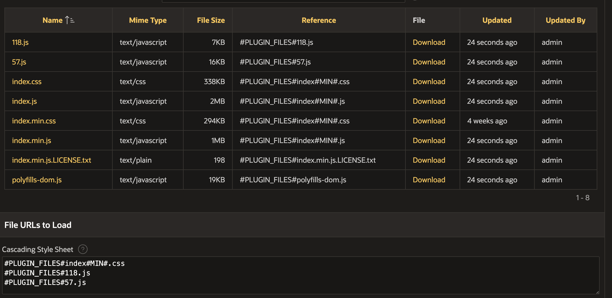

# Plug-In Development

## Potential Issues

### Chunked / lazy loaded JS files

Sometimes bundlers like to chunk JS files into multiple files. These files are loaded on demand, e. g. when the user made a specific action. This is good for online apps at it reduces initial load time but this can cause issues while offline as the files did not get cached on page load.

The solution is to just add all files to `File URLs to Load`:

